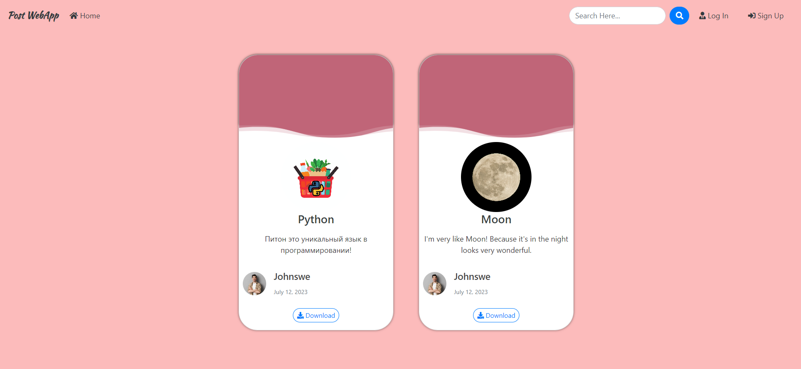
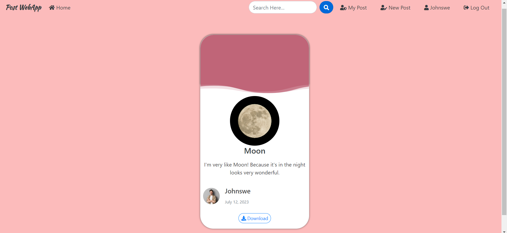

# PostApp


##  Post Application

> Это документация для приложения "Блог на Django - Post Application", которое позволяет пользователям создавать и отображать свои собственные посты. Каждый пост содержит изображение, заголовок, текст, дату и имя пользователя, создавшего его.



**Пример программы так работает.**


## Установка

**Для установки программы, выполните следующие шаги:**

1. Установите Python на вашу систему, если он еще не установлен. Вы можете скачать Python с официального сайта: https://www.python.org/downloads/

2. Клонируйте репозиторий с GitHub:
 ```bash
$  git clone https://github.com/Humoyun004/PostApp.git
```

3. Перейдите в директорию с программой:
cd PostApp 

## Использование
**После того, как вы загрузили django, перейдите в каталог клонированного репо и выполните следующую команду**
```bash
$ python manage.py makemigrations
```

**Это создаст все файлы миграции (миграции базы данных), необходимые для запуска этого приложения.**

**Теперь, чтобы применить эту миграцию, выполните следующую команду**
```bash
$ python manage.py migrate
```
**Один последний шаг, и тогда наше приложение Post будет запущено. Нам нужно создать пользователя-администратора для запуска этого приложения. В терминале введите следующую команду и укажите имя пользователя, пароль и адрес электронной почты для пользователя-администратора.**
```bash
$ python manage.py createsuperuser
```
 **Запустите программу с помощью команды:**
```bash
$ python manage.py runserver
```
### Создание поста
1. **Зарегистрируйте аккаунт или войдите, если у вас уже есть аккаунт.**
2. **После входа в систему нажмите на кнопку "Создать пост".**
3. **Заполните необходимые поля:**
    - Изображение: Выберите файл изображения на вашем компьютере.
    - Заголовок: Введите заголовок вашего поста.
    - Текст: Напишите содержание вашего поста.
4. Нажмите кнопку "Отправить", чтобы создать пост.
5. Ваш пост будет отображаться на главной странице.

### Просмотр постов
- **Все посты, созданные пользователями, будут отображаться на главной странице.**
- **Каждый пост будет содержать следующие детали:**
    - Изображение: Загруженное изображение для поста.
    - Заголовок: Заголовок поста.
    - Текст: Содержание поста.
    - Дата: Дата создания поста.
    - Пользователь: Имя пользователя, создавшего пост.
### Редактирование профиля
- **Чтобы отредактировать информацию в профиле, нажмите на свое имя пользователя в навигационной панели и выберите "Профиль" из выпадающего меню.**
- **Обновите нужные поля, такие как электронная почта, телефон и дата рождения.**
- **Нажмите кнопку "Сохранить", чтобы обновить информацию профиля.**

## Вклад
**Если вы хотите внести свой вклад в развитие приложения "Блог на Django", пожалуйста, следуйте этим шагам:**

1. Форкните репозиторий на GitHub.
2. Клонируйте ваш форк репозитория на локальную машину.
3. Создайте новую ветку для вашей функции или исправления ошибки.
4. Внесите изменения и сделайте коммиты с описательными сообщениями.
5. Отправьте ваши изменения в ваш форк репозитория.
6. Создайте pull request (запрос на включение) в основной репозиторий.

## Благодарности
- Фреймворк Django: https://www.djangoproject.com/
- Фреймворк Bootstrap: https://getbootstrap.com/

## Дополнительные ресурсы
- **Документация Django:** https://docs.djangoproject.com/

## Контакты
**Если у вас есть вопросы или предложения относительно приложения "Блог на Django", пожалуйста, свяжитесь с нами по адресу humoyunakbaraliev1@gmail.com. Мы ценим ваше мнение!**


